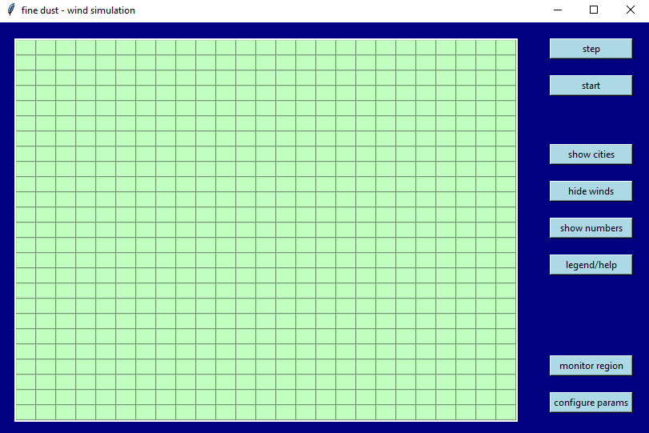
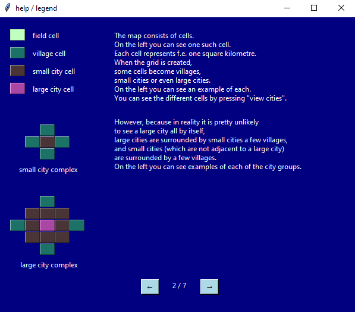

# Fine dust wind simulation

Fiduwisi, or fine dust - wind simulation, is a small programm designed to simulate
the creation and spreading of fine dust in the air, or air pollution in general.
It is written in Python 3 and has a GUI which was made with tkinter.

For a one-minute-summary of the project, view [this](https://www.youtube.com/watch?v=toh_om2PYSk) YouTube-video.

**Table of contents**
- [Fine dust wind simulation](#fine-dust-wind-simulation)
  - [Installation](#installation)
  - [Usage](#usage)
  - [Tutorial](#tutorial)

---

## Installation

To run fiduwisi all you need to do is download this repository and run the fiduwisi.exe-file
contained in the exe-folder. The .exe-file was created using pyinstaller.

**Because the .exe-file is slightly larger than 100MB you can instead download it [here](https://drive.google.com/file/d/1mTWdesPBQAhFoIu9HzzMKPLswOtGO5Rf/view?usp=sharing) from Google Drive**

If you can not or do not want to run the .exe-file you can run the fiduwisi.py-script instead.
For this you will need:
- Python > 3.6
- Numpy > 1.17.2
- Matplotlib > 3.0.2

---

## Usage

Once you start fiduwisi, a window should appear that looks something like this: 

For a simple introduction to the mechanics of fiduwisi, see the [Tutorial](#tutorial)

You can start/stop the simulation or perform a single iteration step using the buttons at the top right.
The grid on the left will display the current state of the simulation live.

---

## Tutorial

You can click on "help/legend" to quickly find all of the necessary details about fiduwisi.
The most important pages are shown here:

Screenshots

 

 

After a few iterations the simulation may look like this:

Screenshot

 

