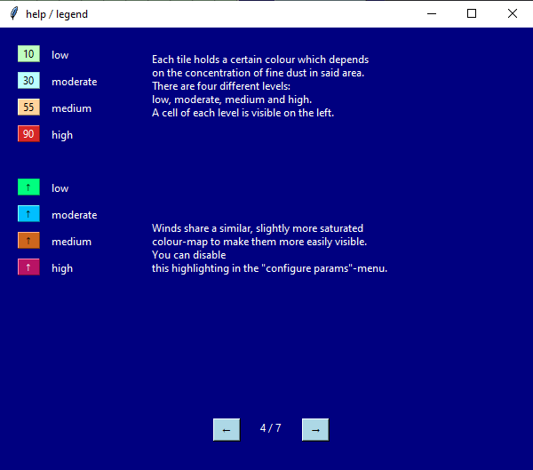

# fiduwisi

Fiduwisi, or fine dust - wind simulation, is a small programm designed to simulate
the creation and spreading of fine dust in the air, or air pollution in general.
It is written in Python 3 with a tkinter-GUI.

## Installation

To run fiduwisi all you need to do is download this repository and run the sim.exe-file
contained in the exe-folder. The .exe-file was created using pyinstaller.
If you can not or do not want to run the .exe-file you can run the sim.py-script instead.
For this you will need:
  -Python >3.6
  -Numpy >1.17.2
  -Matplotlib >3.0.2

## Usage

Once you start fiduwisi, a window should appear that looks something like this: 

For a simple introduction to the mechanics of fiduwisi, see the [Tutorial](#markdown-header-Tutorial)

You can start/stop the simulation or perform a single iteration step using the buttons at the top right.
The grid on the left will display the current state of the simulation live.

## Tutorial

You can click on "help/legend" to quickly find all of the necessary details about fiduwisi.
The most important pages are shown here:
 
 

